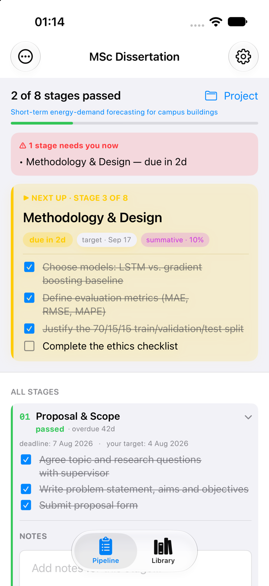
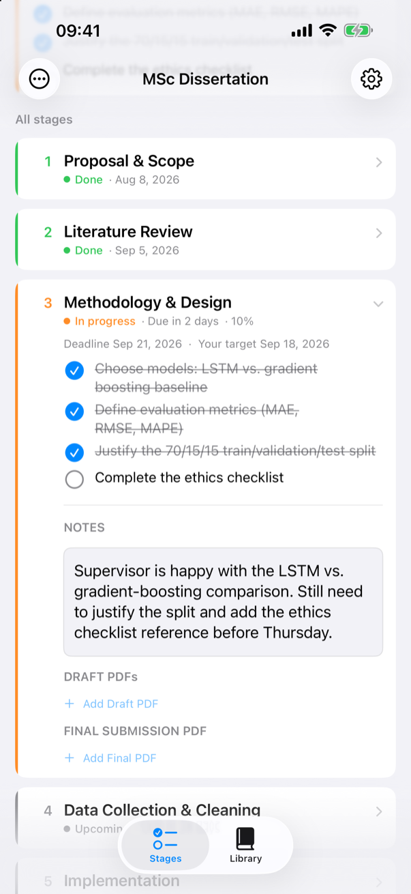
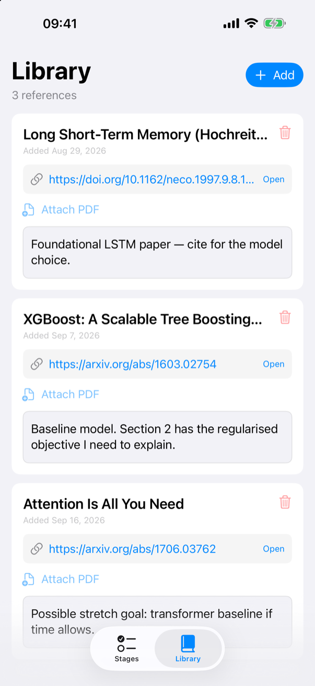
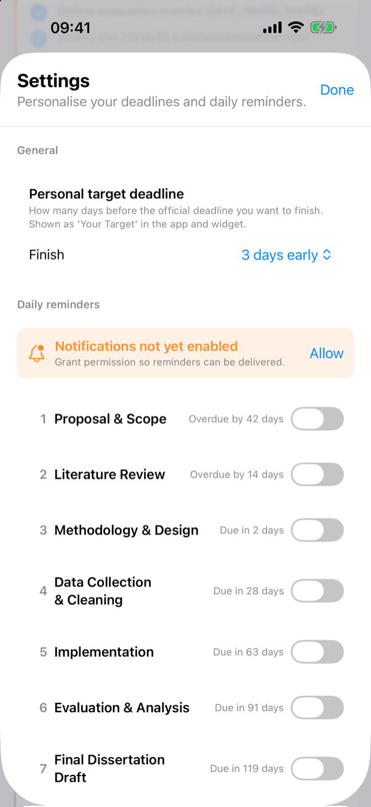
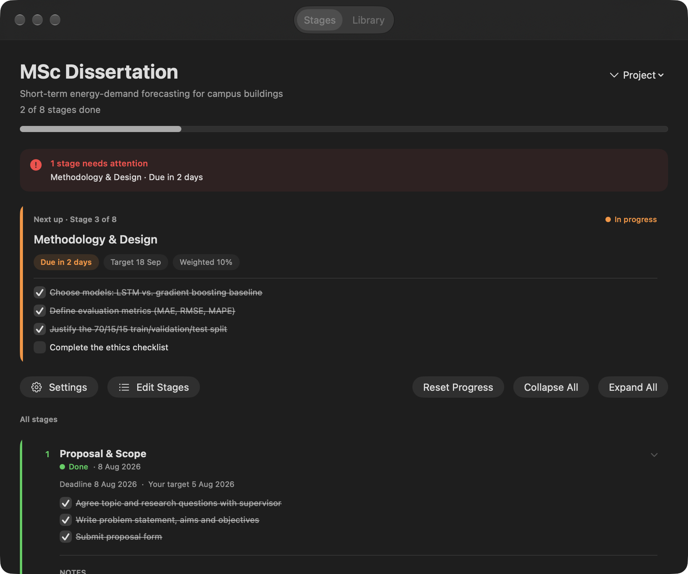

# Project Tracker

A stage-by-stage deadline tracker for university and academic projects (thesis, dissertation, final-year or capstone project) and for smaller personal projects that run through a fixed sequence of milestones. Native SwiftUI for iPhone, iPad and Mac, with iCloud sync, a home-screen widget, and no accounts or analytics.

<p align="center">
  
  
  
  
</p>
<p align="center">
  
</p>

## Who it is for

- **Students** working through a final-year project, dissertation or thesis: proposal, literature review, methodology, implementation, evaluation, final submission, each with a real deadline and often a weighting.
- **Researchers** running a small study with a handful of dated milestones.
- **Anyone with a personal project** that breaks into ordered stages with dates: a certification, a portfolio, a side-project launch.

It is deliberately a single-person tool. One person, their stages, their deadlines. There is no collaboration, no server and no account.

## What it does

- **Stages with deadlines and weights.** Every stage has a title, an optional deadline, an optional weighting such as "15%", and a checklist of tasks. A stage passes when every task is ticked.
- **Status at a glance.** Each stage is *passed*, *running*, *blocked* (overdue) or *queued*, colour-coded, computed from the deadline and your personal buffer.
- **Next-up spotlight and urgent banner.** The first unfinished stage is pinned at the top with its checklist. Anything due within three days gets a red banner.
- **Personal target buffer.** Aim to finish 0 to 7 days before the official date. The app and the widget show "your target" next to the real deadline.
- **Notes and PDFs per stage.** Free-form notes, plus draft PDFs and a final-submission PDF attached to each stage.
- **Reference library.** Papers, links, notes and PDFs in their own tab.
- **Daily reminders.** Per-stage local notifications on the weekdays and time you choose. Nothing is scheduled until you ask for it.
- **Multiple projects.** Create, switch, rename and delete projects. Resetting progress requires typing CONFIRM.
- **Widget in three sizes.** Next stage, deadline, target, task checklist and notes. Long-press the widget to pin it to one project or let it follow whichever project is active.
- **iCloud sync.** Projects, notes, PDFs and references sync between your Mac and iPhone through your own iCloud Drive. It also works offline and without an iCloud account, using local storage.
- **Tailor the template with an AI assistant.** Export a project as JSON, hand it to ChatGPT or Claude together with your real stages, deadlines and weightings, and import the result. Ticked tasks survive the round-trip.

## Tailoring a project with an AI assistant

1. **Create a project.** It starts from a generic six-stage template with deadlines spread over the coming months.
2. **Export.** Project menu → *Export for AI / Backup…*. The JSON file carries an `_instructions` block that tells the assistant exactly what it may change.
3. **Describe your situation.** Attach the file in any capable assistant and give it your module handbook, milestone list or submission dates, plus a sentence about the project itself.
4. **Import.** Project menu → *Import Project JSON…* and pick the file the assistant returned.

Stages and tasks are matched by UUID, so renaming or reordering never loses progress. The importer is deliberately forgiving: it strips markdown fences and commentary, accepts tasks written as bare strings, invents missing ids, de-duplicates repeated ids, and drops progress for tasks that no longer exist.

```json
{
  "schemaVersion": 1,
  "id": "3F2504E0-4F89-41D3-9A0C-0305E82C3301",
  "_instructions": "HOW TO TAILOR THIS TRACKER TO YOUR PROJECT ...",
  "definition": {
    "name": "MSc Dissertation",
    "topic": "Short-term energy-demand forecasting for campus buildings",
    "stages": [
      {
        "id": "…", "title": "Methodology & Design", "weight": "10%", "deadline": "2026-09-20",
        "tasks": [ { "id": "…", "title": "Define evaluation metrics (MAE, RMSE, MAPE)" } ]
      }
    ]
  },
  "progress": { "completedTaskIDs": [ "…" ] }
}
```

## Requirements

- iOS 17 / iPadOS 17 or later, macOS 14 or later.
- Xcode 26 or later to build.

## Building it yourself

```bash
git clone https://github.com/lkavi/ProjectTracker.git
cd ProjectTracker
cp Config/Local.xcconfig.example Config/Local.xcconfig   # then put your Apple Team ID in it
open ProjectTracker.xcodeproj
```

Select the **ProjectTracker** scheme and run on *My Mac* or an iPhone simulator. `Config/Local.xcconfig` is git-ignored, so your Team ID never ends up in a commit.

**If you fork this to ship your own build**, the Apple-registered identifiers belong to the original developer account and must be replaced with yours: the bundle identifiers in the app and widget targets, the iCloud container `iCloud.lkavi.fyppipeline` and the App Group `group.lkavi.fyppipeline` in both `.entitlements` files, `CloudContainer.containerID`, and `ProgressStore.appGroupID`. Xcode's automatic signing registers new identifiers for you once they are changed. The `FYPPipeline` folder name inside the container is the app's original name and is kept on purpose so that existing users' data keeps loading.

## Running the tests

```bash
xcodebuild test -project ProjectTracker.xcodeproj -scheme ProjectTracker \
  -destination 'platform=macOS' -only-testing:ProjectTrackerTests
```

The unit tests cover the status rules, the lenient JSON decoding, the progress helpers and the import pipeline.

The UI tests drive the real app on a simulator. They launch it with `--ui-testing`, which keeps all data in a scratch folder and skips iCloud, so they never touch real projects:

```bash
xcodebuild test -project ProjectTracker.xcodeproj -scheme ProjectTracker \
  -destination 'platform=iOS Simulator,name=iPhone 17 Pro' -only-testing:ProjectTrackerUITests
```

## Project layout

```
ProjectTracker/                 App target (SwiftUI, iOS + macOS in one target)
  ProjectTrackerApp.swift         Entry point, iCloud container bootstrap
  ContentView.swift               Pipeline tab: header, urgent banner, next-up card, stage list, project menu
  StageRowView.swift              Collapsible stage card with checklist
  StageNotesView.swift            Per-stage notes plus draft / final PDFs
  ResearchView.swift              Reference library tab
  NotificationSettingsView.swift  Settings: target buffer, daily reminders, iCloud status
  NotificationStore.swift         Reminder preferences and scheduling
  ProjectStore.swift              Project JSON files, export/import, widget snapshots
  ArtifactsStore.swift            Notes and PDF persistence per stage
  ResearchStore.swift             Library persistence
  CloudContainer.swift            iCloud Drive resolution, coordinated file I/O, change monitoring
  PersonalizeGuideView.swift      The export → AI → import walkthrough shown after creating a project
  StorageErrors.swift             Collects file-system failures for the "Couldn't save" alert
  UITestSupport.swift             --ui-testing launch hooks: scratch data folder, no iCloud
  PrivacyInfo.xcprivacy           Privacy manifest
Shared/                         Model, status rules and widget snapshot store (compiled into app and widget)
ProjectTrackerWidget/           WidgetKit extension with a per-project configuration intent
ProjectTrackerTests/            Unit tests (Swift Testing)
ProjectTrackerUITests/          XCUITest flows: first project, stage completion, relaunch, reset, settings, library
Config/                         Shared.xcconfig and Local.xcconfig.example (Team ID lives in the ignored Local.xcconfig)
Tools/generate_icon.swift       Script that renders the app icon PNGs
docs/                           README screenshots, App Store listing copy, publishing guide and store screenshots
```

## Where your data lives

Everything is plain files in your own iCloud Drive container (or local Documents when iCloud is unavailable): one JSON file per project, one JSON file of notes per stage, PDFs in per-stage folders, and a JSON index for the library. The app never talks to a server. See [PRIVACY.md](PRIVACY.md).

## Current limitations

- Stages and tasks are edited through the JSON export/import round-trip (or an AI assistant). There is no in-app stage editor yet.
- English only.
